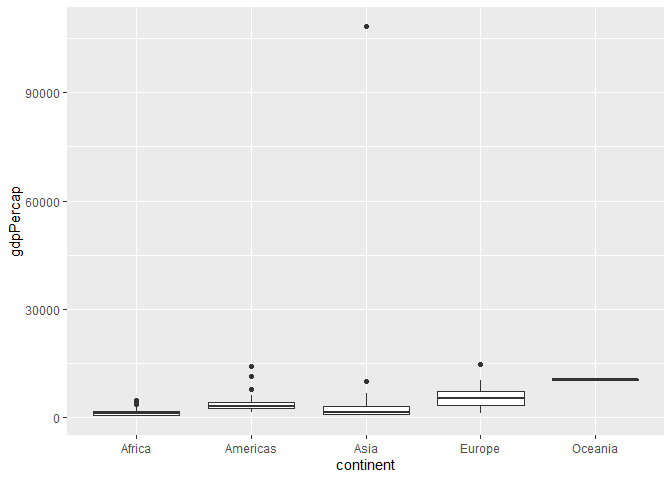

Gapminder
================
Lucien Lin
3/2/2025

- [Grading Rubric](#grading-rubric)
  - [Individual](#individual)
  - [Submission](#submission)
- [Guided EDA](#guided-eda)
  - [**q0** Perform your “first checks” on the dataset. What variables
    are in
    this](#q0-perform-your-first-checks-on-the-dataset-what-variables-are-in-this)
  - [**q1** Determine the most and least recent years in the `gapminder`
    dataset.](#q1-determine-the-most-and-least-recent-years-in-the-gapminder-dataset)
  - [**q2** Filter on years matching `year_min`, and make a plot of the
    GDP per capita against continent. Choose an appropriate `geom_` to
    visualize the data. What observations can you
    make?](#q2-filter-on-years-matching-year_min-and-make-a-plot-of-the-gdp-per-capita-against-continent-choose-an-appropriate-geom_-to-visualize-the-data-what-observations-can-you-make)
  - [**q3** You should have found *at least* three outliers in q2 (but
    possibly many more!). Identify those outliers (figure out which
    countries they
    are).](#q3-you-should-have-found-at-least-three-outliers-in-q2-but-possibly-many-more-identify-those-outliers-figure-out-which-countries-they-are)
  - [**q4** Create a plot similar to yours from q2 studying both
    `year_min` and `year_max`. Find a way to highlight the outliers from
    q3 on your plot *in a way that lets you identify which country is
    which*. Compare the patterns between `year_min` and
    `year_max`.](#q4-create-a-plot-similar-to-yours-from-q2-studying-both-year_min-and-year_max-find-a-way-to-highlight-the-outliers-from-q3-on-your-plot-in-a-way-that-lets-you-identify-which-country-is-which-compare-the-patterns-between-year_min-and-year_max)
- [Your Own EDA](#your-own-eda)
  - [**q5** Create *at least* three new figures below. With each figure,
    try to pose new questions about the
    data.](#q5-create-at-least-three-new-figures-below-with-each-figure-try-to-pose-new-questions-about-the-data)

*Purpose*: Learning to do EDA well takes practice! In this challenge
you’ll further practice EDA by first completing a guided exploration,
then by conducting your own investigation. This challenge will also give
you a chance to use the wide variety of visual tools we’ve been
learning.

<!-- include-rubric -->

# Grading Rubric

<!-- -------------------------------------------------- -->

Unlike exercises, **challenges will be graded**. The following rubrics
define how you will be graded, both on an individual and team basis.

## Individual

<!-- ------------------------- -->

| Category | Needs Improvement | Satisfactory |
|----|----|----|
| Effort | Some task **q**’s left unattempted | All task **q**’s attempted |
| Observed | Did not document observations, or observations incorrect | Documented correct observations based on analysis |
| Supported | Some observations not clearly supported by analysis | All observations clearly supported by analysis (table, graph, etc.) |
| Assessed | Observations include claims not supported by the data, or reflect a level of certainty not warranted by the data | Observations are appropriately qualified by the quality & relevance of the data and (in)conclusiveness of the support |
| Specified | Uses the phrase “more data are necessary” without clarification | Any statement that “more data are necessary” specifies which *specific* data are needed to answer what *specific* question |
| Code Styled | Violations of the [style guide](https://style.tidyverse.org/) hinder readability | Code sufficiently close to the [style guide](https://style.tidyverse.org/) |

## Submission

<!-- ------------------------- -->

Make sure to commit both the challenge report (`report.md` file) and
supporting files (`report_files/` folder) when you are done! Then submit
a link to Canvas. **Your Challenge submission is not complete without
all files uploaded to GitHub.**

``` r
library(tidyverse)
```

    ## ── Attaching core tidyverse packages ──────────────────────── tidyverse 2.0.0 ──
    ## ✔ dplyr     1.1.4     ✔ readr     2.1.5
    ## ✔ forcats   1.0.0     ✔ stringr   1.5.1
    ## ✔ ggplot2   3.5.1     ✔ tibble    3.2.1
    ## ✔ lubridate 1.9.4     ✔ tidyr     1.3.1
    ## ✔ purrr     1.0.2     
    ## ── Conflicts ────────────────────────────────────────── tidyverse_conflicts() ──
    ## ✖ dplyr::filter() masks stats::filter()
    ## ✖ dplyr::lag()    masks stats::lag()
    ## ℹ Use the conflicted package (<http://conflicted.r-lib.org/>) to force all conflicts to become errors

``` r
library(gapminder)
```

*Background*: [Gapminder](https://www.gapminder.org/about-gapminder/) is
an independent organization that seeks to educate people about the state
of the world. They seek to counteract the worldview constructed by a
hype-driven media cycle, and promote a “fact-based worldview” by
focusing on data. The dataset we’ll study in this challenge is from
Gapminder.

# Guided EDA

<!-- -------------------------------------------------- -->

First, we’ll go through a round of *guided EDA*. Try to pay attention to
the high-level process we’re going through—after this guided round
you’ll be responsible for doing another cycle of EDA on your own!

### **q0** Perform your “first checks” on the dataset. What variables are in this

dataset?

``` r
## TASK: Do your "first checks" here!
glimpse(gapminder)
```

    ## Rows: 1,704
    ## Columns: 6
    ## $ country   <fct> "Afghanistan", "Afghanistan", "Afghanistan", "Afghanistan", …
    ## $ continent <fct> Asia, Asia, Asia, Asia, Asia, Asia, Asia, Asia, Asia, Asia, …
    ## $ year      <int> 1952, 1957, 1962, 1967, 1972, 1977, 1982, 1987, 1992, 1997, …
    ## $ lifeExp   <dbl> 28.801, 30.332, 31.997, 34.020, 36.088, 38.438, 39.854, 40.8…
    ## $ pop       <int> 8425333, 9240934, 10267083, 11537966, 13079460, 14880372, 12…
    ## $ gdpPercap <dbl> 779.4453, 820.8530, 853.1007, 836.1971, 739.9811, 786.1134, …

``` r
names(gapminder)
```

    ## [1] "country"   "continent" "year"      "lifeExp"   "pop"       "gdpPercap"

**Observations**:

- Country
- Continent
- Year
- LifeExp
- Pop
- gdpPercap

### **q1** Determine the most and least recent years in the `gapminder` dataset.

*Hint*: Use the `pull()` function to get a vector out of a tibble.
(Rather than the `$` notation of base R.)

``` r
## TASK: Find the largest and smallest values of `year` in `gapminder`
year_max <- 
    max(pull(gapminder, year))
year_max
```

    ## [1] 2007

``` r
year_min <- 
    min(pull(gapminder, year))
year_min
```

    ## [1] 1952

Use the following test to check your work.

``` r
## NOTE: No need to change this
assertthat::assert_that(year_max %% 7 == 5)
```

    ## [1] TRUE

``` r
assertthat::assert_that(year_max %% 3 == 0)
```

    ## [1] TRUE

``` r
assertthat::assert_that(year_min %% 7 == 6)
```

    ## [1] TRUE

``` r
assertthat::assert_that(year_min %% 3 == 2)
```

    ## [1] TRUE

``` r
if (is_tibble(year_max)) {
  print("year_max is a tibble; try using `pull()` to get a vector")
  assertthat::assert_that(False)
}

print("Nice!")
```

    ## [1] "Nice!"

### **q2** Filter on years matching `year_min`, and make a plot of the GDP per capita against continent. Choose an appropriate `geom_` to visualize the data. What observations can you make?

You may encounter difficulties in visualizing these data; if so document
your challenges and attempt to produce the most informative visual you
can.

``` r
## TASK: Create a visual of gdpPercap vs continent
df_q2_a <- 
gapminder %>%
  filter(
    year == year_min
  ) %>% 
  ggplot(
    aes(
      x = continent, 
      y = gdpPercap
    )
  ) + 
  geom_boxplot() 

df_q2_b <-
  gapminder %>%
  filter(
    year == year_min, 
    gdpPercap < 15000
  ) %>% 
  ggplot(
    aes(
      x = continent, 
      y = gdpPercap
    )
  ) + 
  geom_boxplot() 

df_q2_a
```

<!-- -->

``` r
df_q2_b
```

<!-- -->

**Observations**:

- Write your observations here
- Asia has a massive outlier that causes the data to be squished
- Europe has the greatest distribution, while Oceania has the lowest
  distribution
- The lowest medium is Africa

**Difficulties & Approaches**:

- Write your challenges and your approach to solving them
- When I generated the first plot, I had trouble reading the graph
  because everything compressed to allow for the Asia outlier to be
  displayed. To account for this, I generated a new plot that filtered
  out that outlier to get a better look at the boxplot data. In this
  case, I think it was okay to do so since I wanted to analyze spread
  and the averages, rather than discussing trends in the outliers.

### **q3** You should have found *at least* three outliers in q2 (but possibly many more!). Identify those outliers (figure out which countries they are).

``` r
## TASK: Identify the outliers from q2
gapminder %>%
  filter(year == year_min) %>%
  group_by(continent) %>%
  mutate(
    q1 = quantile(gdpPercap, 0.25),
    q3 = quantile(gdpPercap, 0.75),
    IQR = q3 - q1, 
    lower_bound = q1 - 1.5 * IQR, 
    upper_bound = q3 + 1.5 * IQR
  ) %>%
  ungroup() %>%
  filter(
    lower_bound > gdpPercap | upper_bound < gdpPercap
  ) %>%
  select(
    country, continent, gdpPercap, everything()
  ) %>%
  arrange(
    desc(gdpPercap)
  ) 
```

    ## # A tibble: 9 × 11
    ##   country continent gdpPercap  year lifeExp    pop    q1    q3   IQR lower_bound
    ##   <fct>   <fct>         <dbl> <int>   <dbl>  <int> <dbl> <dbl> <dbl>       <dbl>
    ## 1 Kuwait  Asia        108382.  1952    55.6 1.6 e5  750. 3035. 2286.      -2679.
    ## 2 Switze… Europe       14734.  1952    69.6 4.82e6 3241. 7237. 3996.      -2752.
    ## 3 United… Americas     13990.  1952    68.4 1.58e8 2428. 3940. 1512.        161.
    ## 4 Canada  Americas     11367.  1952    68.8 1.48e7 2428. 3940. 1512.        161.
    ## 5 Bahrain Asia          9867.  1952    50.9 1.20e5  750. 3035. 2286.      -2679.
    ## 6 Venezu… Americas      7690.  1952    55.1 5.44e6 2428. 3940. 1512.        161.
    ## 7 South … Africa        4725.  1952    45.0 1.43e7  535. 1455.  920.       -845.
    ## 8 Gabon   Africa        4293.  1952    37.0 4.21e5  535. 1455.  920.       -845.
    ## 9 Angola  Africa        3521.  1952    30.0 4.23e6  535. 1455.  920.       -845.
    ## # ℹ 1 more variable: upper_bound <dbl>

**Observations**:

- Identify the outlier countries from q2
  - (Your response here)
  - Kuwait
  - Switzerland
  - United States

*Hint*: For the next task, it’s helpful to know a ggplot trick we’ll
learn in an upcoming exercise: You can use the `data` argument inside
any `geom_*` to modify the data that will be plotted *by that geom
only*. For instance, you can use this trick to filter a set of points to
label:

``` r
## NOTE: No need to edit, use ideas from this in q4 below
gapminder %>%
  filter(year == max(year)) %>%

  ggplot(aes(continent, lifeExp)) +
  geom_boxplot() +
  geom_point(
    data = . %>% filter(country %in% c("United Kingdom", "Japan", "Zambia")),
    mapping = aes(color = country),
    size = 2
  )
```

<!-- -->

### **q4** Create a plot similar to yours from q2 studying both `year_min` and `year_max`. Find a way to highlight the outliers from q3 on your plot *in a way that lets you identify which country is which*. Compare the patterns between `year_min` and `year_max`.

*Hint*: We’ve learned a lot of different ways to show multiple
variables; think about using different aesthetics or facets.

``` r
## TASK: Create a visual of gdpPercap vs continent
gapminder %>%
  filter(
    year %in% c(year_min, year_max)
  ) %>%
  ggplot(
    aes(
      x = continent, 
      y = gdpPercap,
      fill = as.factor(year)
    )
  ) +
  geom_boxplot() +
  geom_point(
    data = . %>% filter(country %in% c("Kuwait", "Switzerland", "United States")),
    mapping = aes(color = country),
    position = position_dodge(width = 0.8), 
    size = 2
  )
```

<!-- -->

**Observations**:

- Write your observations here
- Generatlly, we see that the average GDP across all the contents have
  increases in 2007. Country-wise, this graph shows that the United
  States and Switzerland have their GDP increased, but Kuwait had their
  GDP dropped. The 2007 boxplots also display a greater distribtion when
  compared to the 1952 variants. Since I don’t know what was going on
  during those years, I would prefer to explain the distribution
  differences to the data variety present for both years. I see that the
  outliers of each country seem to remain outliers in both years, except
  for Switzerland.

# Your Own EDA

<!-- -------------------------------------------------- -->

Now it’s your turn! We just went through guided EDA considering the GDP
per capita at two time points. You can continue looking at outliers,
consider different years, repeat the exercise with `lifeExp`, consider
the relationship between variables, or something else entirely.

### **q5** Create *at least* three new figures below. With each figure, try to pose new questions about the data.

``` r
## TASK: Your first graph
gapminder %>%
  filter(
    year %in% c(year_min, year_max)
  ) %>%
  ggplot(
    aes(
      x = continent, 
      y = lifeExp,
      fill = as.factor(year)
    )
  ) +
  geom_boxplot()
```

<!-- -->

- (Your notes and observations here)
- There is a positive trend with life expectancy across all the
  continents. The data distribution for Oceania is extremely low. This
  may be due to lack of data to display. Asia seems to have an even
  distribution, while the Americas and Europe had tigher distributions
  during 2007.

``` r
## TASK: Your second graph
gapminder %>%
  mutate(year = as.factor(year)) %>%
  filter(
    year %in% c(1952, 1962, 1972, 1982, 1992, 2007)
  ) %>%
  ggplot(
    aes(
      x = continent, 
      y = gdpPercap,
      fill = as.factor(year)
    )
  ) +
  geom_boxplot()
```

<!-- -->

- (Your notes and observations here)
- This boxplot looks at the trends of how each continents’ GDP per
  Capita increases every ~10 years. I see that generally, the trend is
  increasing, but developing a linear regression model for the data
  might be difficult since certain continents such as Asia and Europe
  have an increased distribution compared to the others. Unless I
  outline what country the specific outliers are, I can’t determine
  whether the countries themselves have increased or decreased.

``` r
## TASK: Your third graph
gapminder %>%
  filter(
    country == "Kuwait"
  ) %>%
  ggplot(
    aes(
      x = year,
      y = gdpPercap
    )
  ) + 
  geom_line()
```

<!-- -->

- This is a line plot that I wanted to look at the trends of the
  outliers that I identified in a previous problem. I noticed that while
  all the continents demonstrated a positive growth in GDP per Capita,
  Kuwait was a country that demonstrated negative growth. Perhaps
  something that I would like to look further for this plot is to find
  the reasoning behind this GDP per Capita decrease. I speculate that
  this may be due to population, which is a graph that I would like to
  look at.
